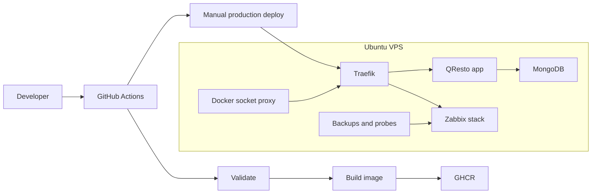

# QResto

QResto is a containerized restaurant menu platform built as a DevOps portfolio project. The application lets a restaurant owner register, manage menu categories and items, upload images, generate table QR codes, and serve a public menu from a root domain or restaurant subdomain.

The current focus of this repository is the operational layer: reproducible provisioning, secure container defaults, CI validation, image publishing, manual production deployment, monitoring, backups, and clear public-ready documentation.

## Tech Stack

| Area | Technology |
| --- | --- |
| Application | Node.js 20.19, Express, EJS |
| Database | MongoDB 6 |
| Reverse proxy | Traefik v3 with Let's Encrypt DNS challenge |
| Containers | Docker, Docker Compose |
| Registry | GitHub Container Registry |
| CI/CD | GitHub Actions |
| Infrastructure | Ansible |
| Monitoring | Zabbix 7, PostgreSQL, cron probes |

## DevOps Highlights

- Non-root application container with a read-only filesystem, dropped Linux capabilities, `no-new-privileges`, health checks, and resource limits.
- Runtime images and the Node base image are pinned by digest for reproducible builds and deployments.
- Traefik reads Docker metadata through a read-only Docker socket proxy instead of mounting the Docker socket directly into the proxy.
- Private Docker networks separate public routing, backend services, monitoring services, and Docker API read access.
- CI runs tests, dependency audit, JavaScript syntax checks, shell syntax checks, and Docker Compose config validation.
- Pull requests also build the Docker image without publishing it, so Dockerfile regressions are caught before merge.
- CI validates Ansible syntax after installing the required Ansible collections.
- GitHub Actions are pinned to commit SHAs and use least-privilege workflow permissions.
- Production deploy is manual (`workflow_dispatch`) and attached to a `production` environment, avoiding accidental deploys from a normal push.
- Ansible provisions the VPS baseline with UFW, fail2ban, Docker, SSH hardening, a deploy user, operational directories, cron jobs, and environment bootstrap files.
- Secrets are kept out of the repository. `.env`, generated inventories, vault files, uploads, backups, and ACME storage are ignored.

## Architecture



## Repository Layout

```text
app/                     Express application
ansible/                 VPS provisioning and inventory examples
docs/                    operational documentation
scripts/                 validation, provisioning, backup, monitoring helpers
.github/workflows/       CI/CD pipeline
docker-compose.yml       production-oriented Compose stack
Dockerfile               application image
.env.example             environment template
```

## Local Validation

```bash
bash scripts/validate.sh
```

The script runs:

- `npm ci`
- `npm test`
- `npm audit --audit-level=moderate`
- JavaScript syntax checks
- shell syntax checks
- `docker compose config`

GitHub Actions additionally runs Ansible syntax validation and builds the Docker image on pull requests.

This project requires Node.js `>=20.19.0`. The GitHub Actions workflow uses `20.19.0`; older local Node versions may print `EBADENGINE` warnings.

## Deployment

1. Provision an Ubuntu 22.04+ VPS with `bash scripts/provision.sh`.
2. Create `/opt/qresto/.env` from `/opt/qresto/.env.bootstrap`.
3. Fill all secrets in `/opt/qresto/.env`.
4. Add GitHub Actions secrets: `VPS_HOST`, `VPS_SSH_USER`, `VPS_SSH_KEY`, and optionally `VPS_SSH_PORT`.
5. Run the `CI/CD Pipeline` workflow manually from GitHub Actions to deploy production.

Detailed steps are in [QUICK_START.md](QUICK_START.md). Operational notes are in [docs/RUNBOOK.md](docs/RUNBOOK.md).

## Security Notes

The stack is hardened for a junior DevOps portfolio level, but it is intentionally documented honestly:

- Membership in the `docker` group is powerful and should be limited to the deploy account.
- Zabbix Agent2 needs host visibility for infrastructure monitoring. It runs without `privileged`, with dropped capabilities and read-only mounts, but it still reads host and Docker metadata.
- The deployment model expects a protected `production` GitHub environment before using this on a real public VPS.

See [docs/DEVOPS_AUDIT.md](docs/DEVOPS_AUDIT.md) for the full checklist.
