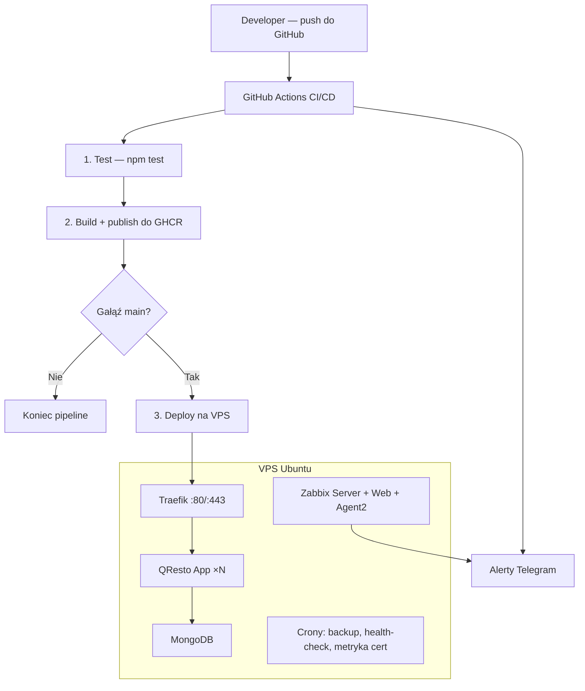

# QResto — Cyfrowe Menu dla Twojej Restauracji 

> Projekt dyplomowy demonstrujący pełny proces DevOps: od kodu aplikacji, przez CI/CD, po monitoring produkcyjny.

---

## Czym jest QResto?

QResto to aplikacja webowa, która pozwala restauracjom stworzyć cyfrowe menu dostępne przez kody QR.
Właściciel restauracji rejestruje się, dodaje kategorie i dania, generuje kody QR dla stolików,
a goście skanują kod i widzą menu na subdomenie (np. `pizzeria.qresto.xyz`).

### Funkcjonalności aplikacji

- **Rejestracja i logowanie** — sesje w MongoDB, hasła hashowane bcrypt
- **Panel zarządzania** — statystyki (liczba kodów QR, liczba dań)
- **CRUD menu** — kategorie → dania (nazwa, opis, cena, zdjęcie, dostępność)
- **Generator kodów QR** — stoliki z linkami do publicznego menu + opcjonalne logo w kodzie QR
- **Publiczne menu** — dostęp przez subdomenę (`restauracja.domena.xyz`) lub ścieżkę (`/menu/restauracja`)
- **Health-checks** — endpointy `/health`, `/live`, `/ready` dla monitoringu i orchestratora

---

## Stack technologiczny

| Warstwa | Technologia |
| --- | --- |
| Backend | Node.js 20 + Express |
| Widoki | EJS (server-side rendering) |
| Baza danych | MongoDB 6 (Mongoose ODM) |
| Konteneryzacja | Docker + Docker Compose |
| Reverse proxy + TLS | Traefik + Let's Encrypt (Cloudflare DNS challenge) |
| CI/CD | GitHub Actions → GHCR (GitHub Container Registry) |
| Provisioning | Ansible + Bash |
| Monitoring | Zabbix 7 (Server + Agent2 + Web) + PostgreSQL |
| Powiadomienia | Telegram Bot (build, deploy, alerty) |

---

## Architektura



---

## Struktura projektu

```
qresto/
├── app/                          # Kod aplikacji
│   ├── server.js                 # Punkt wejścia Express
│   ├── package.json
│   ├── src/
│   │   ├── config/
│   │   │   ├── db.js             # Połączenie z MongoDB
│   │   │   └── upload.js         # Konfiguracja Multer (upload zdjęć)
│   │   ├── middleware/
│   │   │   └── auth.js           # requireAuth, forwardAuthenticated, setLocals
│   │   ├── models/
│   │   │   ├── User.js           # Restauracja (nazwa, email, hasło, logo)
│   │   │   ├── Menu.js           # Menu → Kategorie → Dania (embedded docs)
│   │   │   └── Table.js          # Stoliki (nazwa + link publiczny)
│   │   ├── routes/
│   │   │   ├── index.js          # Landing, dashboard
│   │   │   ├── auth.js           # Rejestracja, logowanie, wylogowanie
│   │   │   ├── menu.js           # CRUD kategorii i dań + publiczny widok
│   │   │   └── qr.js             # CRUD stolików, upload logo
│   │   └── utils/
│   │       └── publicMenu.js     # Slug restauracji, subdomena → regex
│   ├── views/                    # Szablony EJS
│   ├── public/                   # Pliki statyczne (CSS, img, uploads)
│   └── tests/                    # Testy (Jest + Supertest)
│
├── ansible/
│   ├── setup.yml                 # Playbook IaC — provisioning VPS
│   └── inventory                 # Generowany przez provision.sh
│
├── scripts/
│   ├── provision.sh              # Interaktywny setup VPS (uruchamia Ansible)
│   ├── traffic-mode.sh           # Skalowanie: normal (1) / high (3 repliki)
│   ├── bootstrap-zabbix.sh       # Automatyczna konfiguracja Zabbix (hosty, triggery, alerty)
│   ├── backup.sh                 # Backup MongoDB + plików konfiguracyjnych
│   ├── check-acme-renew.sh       # Walidacja certyfikatów ACME
│   └── push-cert-metric.sh       # Push metryki ważności certyfikatu do Zabbix
│
├── .github/workflows/
│   └── ci-cd.yml                 # Pipeline: test → build → deploy
│
├── docker-compose.yml            # Definicja wszystkich usług
├── Dockerfile                    # Obraz aplikacji (Node 20 Alpine)
├── .env.example                  # Szablon zmiennych środowiskowych
└── QUICK_START.md                # Instrukcja wdrożenia krok po kroku
```

---

## Pokrycie Kryteriów Dyplomu (DevOps)

- **IaC (idempotentnie, od zera):** `ansible/setup.yml` + `scripts/provision.sh`
- **Mało komend do startu:** provisioning przez `bash scripts/provision.sh`
- **CI/CD dla każdej gałęzi:** push uruchamia test, build i publikację artefaktu (GHCR)
- **CD dla `main`:** push na `main` uruchamia automatyczny deploy na VPS
- **Powiadomienia:** Telegram dla build/publish/deploy (success/failure)
- **Monitoring:** Zabbix (server/web/agent2), endpointy `/health`, `/live`, `/ready`, crony metryk i health-check
- **Konteneryzacja:** Dockerfile + docker-compose
- **Skalowanie (demo):** `scripts/traffic-mode.sh` (1 lub 3 repliki app)
- **TLS/SSL:** Traefik + Let's Encrypt (Cloudflare DNS challenge)

---

## Pipeline CI/CD

Pipeline (`.github/workflows/ci-cd.yml`) składa się z 3 etapów:

| Etap | Trigger | Co robi |
| --- | --- | --- |
| **Test** | Każdy push i PR | `npm ci` + `npm test` (Jest) |
| **Build & Publish** | Każdy push (po testach) | Buduje obraz Docker, publikuje do GHCR, powiadomienie Telegram |
| **Deploy** | Push na `main` (po buildzie) | SCP kodu na VPS → `docker compose up -d`, powiadomienie Telegram |

---

## Usługi Docker Compose

| Usługa | Obraz | Opis |
| --- | --- | --- |
| `traefik` | `traefik:latest` | Reverse proxy, HTTPS, wildcard cert (Cloudflare DNS) |
| `app` | GHCR (lub lokalny build) | Aplikacja QResto (port 3000) |
| `mongodb` | `mongo:6.0` | Baza danych aplikacji |
| `zabbix-db` | `postgres:15-alpine` | Baza danych Zabbix |
| `zabbix-server` | `zabbix-server-pgsql:7.0` | Serwer monitoringu |
| `zabbix-agent2` | `zabbix-agent2:7.0` | Agent monitoringu na hoście |
| `zabbix-web` | `zabbix-web-nginx-pgsql:7.0` | Interfejs Zabbix (subdomena zabbix.*) |

---

## Skalowanie ruchu (demo)

Na VPS można przełączać liczbę replik aplikacji — Traefik automatycznie rozkłada ruch:

```bash
# Tryb normalny — 1 replika
bash /opt/qresto/scripts/traffic-mode.sh normal

# Tryb wzmożonego ruchu — 3 repliki
bash /opt/qresto/scripts/traffic-mode.sh high

# Sprawdzenie aktualnego stanu
bash /opt/qresto/scripts/traffic-mode.sh status
```

---

## Szybki start

Pełna instrukcja wdrożenia krok po kroku: **[QUICK_START.md](QUICK_START.md)**

W skrócie:
1. Skonfiguruj DNS w Cloudflare (rekord A dla `@` i `*`)
2. Utwórz repozytorium na GitHub i dodaj wymagane sekrety
3. Zainstaluj Ansible i sklonuj repo
4. Uruchom `bash scripts/provision.sh` — provisioning VPS
5. Utwórz plik `.env` na VPS i uzupełnij sekrety
6. Wypchnij kod na `main` — pipeline automatycznie wdroży aplikację

---

## Wymagania

- **VPS**: Ubuntu 22.04+ z dostępem SSH (root do pierwszego provisioningu)
- **Domena**: skonfigurowana w Cloudflare z tokenem DNS API
- **Lokalnie**: Ansible, Git, klucz SSH (ed25519)
- **GitHub**: repo z włączonym GHCR i skonfigurowanymi sekretami

---

## Bezpieczeństwo (DevOps)

W projekcie wdrożono praktyki bezpieczeństwa DevOps obejmujące provisioning, pipeline, infrastrukturę i utrzymanie produkcyjne:

- **Hardening serwera przez IaC (Ansible)**: automatyczna konfiguracja UFW, fail2ban, wyłączenie logowania hasłem przez SSH, wyłączenie logowania root oraz dedykowany użytkownik deploy.
- **Kontrola dostępu do usług**: publicznie wystawione są tylko porty 80/443 przez Traefik; MongoDB działa wyłącznie w sieci wewnętrznej Dockera, a Zabbix Server jest mapowany lokalnie na host.
- **Szyfrowanie ruchu i certyfikaty TLS**: ruch HTTPS jest terminowany przez Traefik, a certyfikaty Let's Encrypt są odnawiane automatycznie.
- **Bezpieczny model wdrożeń**: pipeline CI/CD uruchamia testy przed publikacją artefaktu i dopiero potem wykonuje deploy na produkcję.
- **Sekrety poza repozytorium**: dane wrażliwe trzymane są w GitHub Secrets oraz pliku `.env` na VPS, a nie w kodzie aplikacji.
- **Monitoring i szybka detekcja incydentów**: Zabbix monitoruje host i aplikację, endpointy `/health`, `/live`, `/ready` wspierają diagnostykę, a alerty trafiają do Telegrama.
- **Odporność operacyjna**: zaplanowane crony wykonują backup oraz zadania kontrolne, co skraca czas reakcji po awarii.
